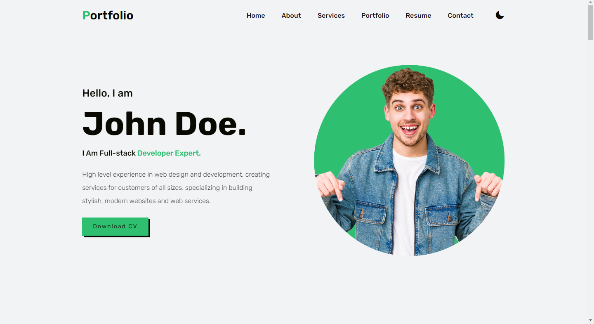

# Responsive Personal Portfolio || Dark/Light Mode

Modern Portfolio Design with dark/light theme, responsive for all devices, built using HTML, CSS and JavaScript

## Index of contents

- [Overview](#overview)
  - [The Project](#the-project)
  - [Screenshot](#screenshot)
- [My process](#my-process)
  - [Built with](#built-with)
  - [What I learned](#what-i-learned)
  - [Useful resources](#useful-resources)
- [Author](#author)

**Note: Delete this note and update the table of contents based on what sections you keep.**

## Overview

### The Project

Users should be able to:

- View the corresponding layout according to the screen size of your device
- View diverse animations and functionalities for interactive elements

### Screenshot

## Development

### Built with

- Semantic HTML5 markup
- CSS Responsive

### What I learned

I learned basic css flexbox and grid properties to convert a simple portfolio in a fully responsive website. I learned how to use scrollreveal js library to provide a better UI experience

### Useful resources

- [ScrollRevealjs](https://scrollrevealjs.org/) - This helped me to animate elements as they enter/leave the viewport
- [softr.io](https://www.softr.io/tools/javascript-scroll-to-top-button) - Using this generator, I implement the scroll-up button that appears when you scroll down the page.
- [Dark/Light Theme feature](https://www.youtube.com/watch?v=9LZGB3OLXNQ&t=343s) - This video taught me how to add the light and dark theme to my website

## Author

### - IvanL
